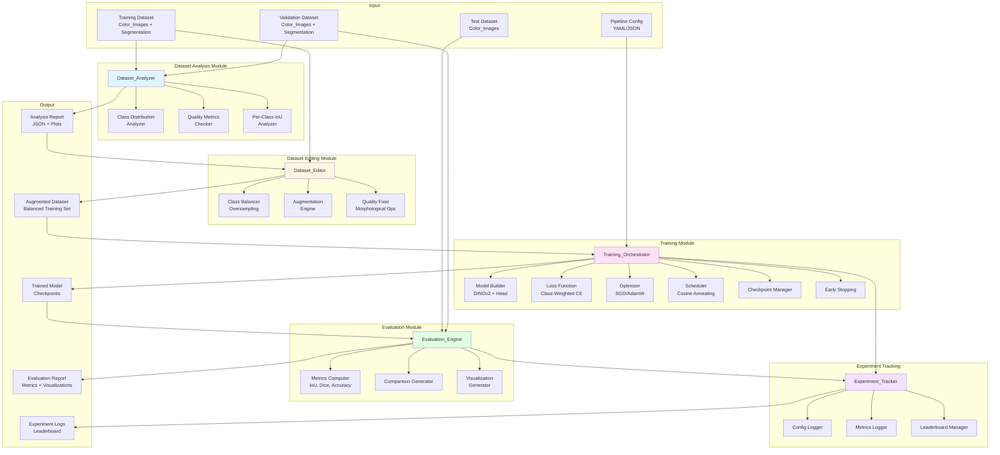
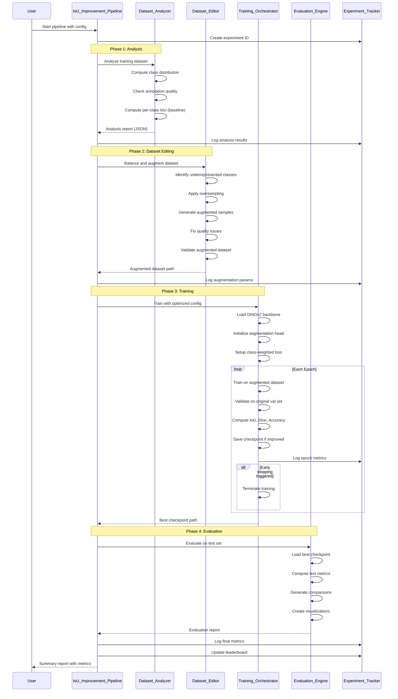

# Design Document: IoU Improvement Pipeline

## Overview

The IoU Improvement Pipeline is a comprehensive system designed to enhance the semantic segmentation performance of the Duality AI Offroad Scene Segmentation project. The current baseline achieves a Mean IoU of 0.41 using a DINOv2-ViT-Small backbone with a ConvNeXt-style segmentation head across 10 terrain classes. The pipeline targets a Mean IoU of 0.75 or higher through systematic dataset analysis, quality improvement, balanced augmentation, optimized training, and advanced techniques.

### Current System Context

**Existing Architecture:**
- **Backbone**: DINOv2-ViT-Small (frozen, pretrained on ImageNet)
- **Segmentation Head**: ConvNeXt-style decoder with 128-channel intermediate layers
- **Input Resolution**: 480×270 pixels (resized to 476×266 for 14×14 patch alignment)
- **Classes**: 11 terrain classes (Background, Trees, Lush Bushes, Dry Grass, Dry Bushes, Ground Clutter, Flowers, Logs, Rocks, Landscape, Sky)
- **Training**: SGD optimizer with momentum 0.9, CrossEntropyLoss, 10 epochs baseline

**Existing Scripts:**
- `train_segmentation (1).py`: Training script with DINOv2 backbone
- `test_segmentation (1).py`: Evaluation and prediction script
- `visualize.py`: High-contrast visualization with color overlays

### Pipeline Goals

1. **Dataset Quality**: Identify and fix annotation issues, class imbalances, and quality problems
2. **Balanced Training**: Apply targeted augmentation to underrepresented classes
3. **Optimized Training**: Implement class-weighted loss, cosine annealing, early stopping, and mixed precision
4. **Advanced Techniques**: Support hard example mining, test-time augmentation, multi-scale training, and deep supervision
5. **Experiment Tracking**: Maintain reproducible configurations and leaderboard of experiments
6. **Automation**: End-to-end pipeline from analysis to evaluation with graceful error handling

## Architecture

### System Components



### Data Flow



### Component Interaction Diagram

```mermaid
graph LR
    subgraph "Dataset_Analyzer"
        A1[load_dataset]
        A2[compute_class_distribution]
        A3[detect_quality_issues]
        A4[compute_baseline_iou]
        A5[generate_report]
    end
    
    subgraph "Dataset_Editor"
        B1[load_analysis_report]
        B2[identify_imbalanced_classes]
        B3[oversample_minority_classes]
        B4[apply_augmentations]
        B5[fix_quality_issues]
        B6[validate_dataset]
        B7[save_augmented_dataset]
    end
    
    subgraph "Training_Orchestrator"
        C1[load_config]
        C2[build_model]
        C3[setup_loss_and_optimizer]
        C4[create_dataloaders]
        C5[train_epoch]
        C6[validate_epoch]
        C7[save_checkpoint]
        C8[check_early_stopping]
    end
    
    subgraph "Evaluation_Engine"
        D1[load_checkpoint]
        D2[run_inference]
        D3[compute_metrics]
        D4[generate_comparisons]
        D5[save_results]
    end
    
    subgraph "Experiment_Tracker"
        E1[create_experiment]
        E2[log_config]
        E3[log_metrics]
        E4[update_leaderboard]
        E5[save_artifacts]
    end
    
    A1 --> A2 --> A3 --> A4 --> A5
    B1 --> B2 --> B3 --> B4 --> B5 --> B6 --> B7
    C1 --> C2 --> C3 --> C4
    C4 --> C5 --> C6 --> C7 --> C8
    C8 --> C5
    D1 --> D2 --> D3 --> D4 --> D5
    E1 --> E2 --> E3 --> E4 --> E5
    
    A5 -.->|report| B1
    B7 -.->|dataset_path| C4
    C7 -.->|checkpoint| D1
    C6 -.->|metrics| E3
    D5 -.->|results| E3
```



## Components and Interfaces

### 1. Dataset_Analyzer

**Purpose**: Analyze the training dataset to identify class imbalances, quality issues, and performance bottlenecks.

**Public Interface**:
```python
class DatasetAnalyzer:
    def __init__(self, dataset_path: str, model_path: Optional[str] = None):
        """
        Initialize analyzer with dataset path and optional baseline model.
        
        Args:
            dataset_path: Path to training dataset root
            model_path: Optional path to baseline model for IoU analysis
        """
        
    def compute_class_distribution(self) -> Dict[int, int]:
        """
        Compute pixel count for each terrain class.
        
        Returns:
            Dictionary mapping class_id to pixel count
        """
        
    def compute_class_balance_ratio(self, distribution: Dict[int, int]) -> Dict[int, float]:
        """
        Calculate balance ratio for each class relative to most frequent.
        
        Args:
            distribution: Class pixel counts
            
        Returns:
            Dictionary mapping class_id to balance ratio (0.0 to 1.0)
        """
        
    def detect_quality_issues(self) -> List[QualityIssue]:
        """
        Identify images with annotation problems.
        
        Returns:
            List of QualityIssue objects with image_id, issue_type, severity
        """
        
    def compute_baseline_per_class_iou(self, model_path: str) -> Dict[int, float]:
        """
        Compute per-class IoU using baseline model predictions.
        
        Args:
            model_path: Path to baseline model checkpoint
            
        Returns:
            Dictionary mapping class_id to IoU score
        """
        
    def generate_report(self, output_path: str) -> AnalysisReport:
        """
        Generate comprehensive analysis report.
        
        Args:
            output_path: Path to save JSON report and plots
            
        Returns:
            AnalysisReport object with all metrics
        """
```

**Data Structures**:
```python
@dataclass
class QualityIssue:
    image_id: str
    issue_type: str  # 'missing_label', 'boundary_error', 'noise', 'invalid_values'
    severity: str    # 'low', 'medium', 'high'
    details: Dict[str, Any]

@dataclass
class AnalysisReport:
    class_distribution: Dict[int, int]
    class_balance_ratios: Dict[int, float]
    imbalanced_classes: List[int]  # Classes with ratio < 0.3
    quality_issues: List[QualityIssue]
    per_class_iou: Dict[int, float]
    poorly_performing_classes: List[int]  # Classes with IoU < 0.4
    total_images: int
    total_pixels: int
    timestamp: str
```

**Implementation Details**:
- Uses PIL/OpenCV for mask loading and analysis
- Implements efficient pixel counting with NumPy vectorization
- Detects boundary errors using morphological operations (erosion/dilation)
- Identifies noise using connected component analysis
- Validates mask values against valid class indices [0-10]
- Generates matplotlib plots for class distribution and IoU scores


### 2. Dataset_Editor

**Purpose**: Balance the dataset through oversampling and augmentation, and fix quality issues.

**Public Interface**:
```python
class DatasetEditor:
    def __init__(self, dataset_path: str, analysis_report: AnalysisReport):
        """
        Initialize editor with dataset and analysis results.
        
        Args:
            dataset_path: Path to original training dataset
            analysis_report: Report from Dataset_Analyzer
        """
        
    def identify_augmentation_targets(self) -> Dict[int, float]:
        """
        Determine augmentation factors for each class.
        
        Returns:
            Dictionary mapping class_id to augmentation factor
        """
        
    def apply_augmentation(self, image: np.ndarray, mask: np.ndarray, 
                          aug_type: str) -> Tuple[np.ndarray, np.ndarray]:
        """
        Apply single augmentation to image-mask pair.
        
        Args:
            image: RGB image array
            mask: Segmentation mask array
            aug_type: One of 'hflip', 'rotate', 'brightness', 'contrast'
            
        Returns:
            Augmented image and mask with pixel-perfect alignment
        """
        
    def oversample_class(self, class_id: int, factor: float) -> List[str]:
        """
        Oversample images containing target class.
        
        Args:
            class_id: Target class to oversample
            factor: Multiplication factor for samples
            
        Returns:
            List of new augmented image IDs
        """
        
    def fix_boundary_errors(self, mask: np.ndarray) -> np.ndarray:
        """
        Apply morphological operations to smooth mask boundaries.
        
        Args:
            mask: Original mask with boundary errors
            
        Returns:
            Corrected mask
        """
        
    def validate_augmented_dataset(self) -> ValidationReport:
        """
        Verify augmented dataset integrity.
        
        Returns:
            ValidationReport with checks on alignment, class distribution, size
        """
        
    def save_augmented_dataset(self, output_path: str) -> str:
        """
        Save balanced and augmented dataset.
        
        Args:
            output_path: Directory to save augmented dataset
            
        Returns:
            Path to saved dataset
        """
```

**Augmentation Pipeline**:
```python
AUGMENTATION_TECHNIQUES = {
    'horizontal_flip': {
        'probability': 0.5,
        'applies_to': 'all_classes'
    },
    'rotation': {
        'range': (-15, 15),  # degrees
        'probability': 0.3,
        'applies_to': 'all_classes'
    },
    'brightness': {
        'range': (0.8, 1.2),  # 20% adjustment
        'probability': 0.4,
        'applies_to': 'all_classes'
    },
    'contrast': {
        'range': (0.8, 1.2),  # 20% adjustment
        'probability': 0.4,
        'applies_to': 'all_classes'
    }
}
```

**Implementation Details**:
- Uses albumentations library for synchronized image-mask augmentation
- Implements class-aware sampling: prioritizes images with underrepresented classes
- Applies augmentation factor of 2.0 for classes with IoU < 0.4
- Applies augmentation factor of 1.5 for classes with balance ratio < 0.5
- Validates mask-image alignment using checksum comparison
- Ensures minimum 5000 training samples after augmentation
- Preserves original validation set without modifications
- Uses OpenCV morphological operations (opening/closing) for boundary smoothing


### 3. Training_Orchestrator

**Purpose**: Manage model training with optimized hyperparameters, class weighting, and advanced techniques.

**Public Interface**:
```python
class TrainingOrchestrator:
    def __init__(self, config: TrainingConfig):
        """
        Initialize orchestrator with training configuration.
        
        Args:
            config: TrainingConfig object with all hyperparameters
        """
        
    def build_model(self, backbone: str = 'dinov2_vits14', 
                   num_classes: int = 11) -> nn.Module:
        """
        Build segmentation model with specified backbone.
        
        Args:
            backbone: Backbone architecture name
            num_classes: Number of segmentation classes
            
        Returns:
            Complete segmentation model
        """
        
    def setup_loss_function(self, class_weights: Optional[torch.Tensor] = None,
                           label_smoothing: float = 0.0) -> nn.Module:
        """
        Create loss function with class weighting and label smoothing.
        
        Args:
            class_weights: Per-class weights based on inverse frequency
            label_smoothing: Label smoothing epsilon (0.0 to 0.2)
            
        Returns:
            Loss function module
        """
        
    def setup_optimizer(self, model: nn.Module, lr: float, 
                       optimizer_type: str = 'sgd') -> torch.optim.Optimizer:
        """
        Create optimizer with specified configuration.
        
        Args:
            model: Model to optimize
            lr: Learning rate
            optimizer_type: 'sgd' or 'adamw'
            
        Returns:
            Optimizer instance
        """
        
    def setup_scheduler(self, optimizer: torch.optim.Optimizer,
                       scheduler_type: str = 'cosine') -> Any:
        """
        Create learning rate scheduler.
        
        Args:
            optimizer: Optimizer to schedule
            scheduler_type: 'cosine', 'step', or 'plateau'
            
        Returns:
            Scheduler instance
        """
        
    def train_epoch(self, model: nn.Module, dataloader: DataLoader,
                   optimizer: torch.optim.Optimizer, loss_fn: nn.Module,
                   use_amp: bool = True) -> Dict[str, float]:
        """
        Train for one epoch.
        
        Args:
            model: Model to train
            dataloader: Training data loader
            optimizer: Optimizer
            loss_fn: Loss function
            use_amp: Use automatic mixed precision
            
        Returns:
            Dictionary with epoch metrics
        """
        
    def validate_epoch(self, model: nn.Module, dataloader: DataLoader,
                      loss_fn: nn.Module) -> Dict[str, float]:
        """
        Validate for one epoch.
        
        Args:
            model: Model to validate
            dataloader: Validation data loader
            loss_fn: Loss function
            
        Returns:
            Dictionary with validation metrics (loss, IoU, Dice, accuracy)
        """
        
    def save_checkpoint(self, model: nn.Module, optimizer: torch.optim.Optimizer,
                       epoch: int, metrics: Dict[str, float], path: str):
        """
        Save training checkpoint.
        
        Args:
            model: Model state
            optimizer: Optimizer state
            epoch: Current epoch
            metrics: Current metrics
            path: Save path
        """
        
    def check_early_stopping(self, val_metric: float, patience: int = 15) -> bool:
        """
        Check if early stopping criteria met.
        
        Args:
            val_metric: Current validation metric (IoU)
            patience: Number of epochs without improvement
            
        Returns:
            True if training should stop
        """
        
    def train(self, train_loader: DataLoader, val_loader: DataLoader,
             num_epochs: int) -> TrainingHistory:
        """
        Execute complete training loop.
        
        Args:
            train_loader: Training data loader
            val_loader: Validation data loader
            num_epochs: Maximum number of epochs
            
        Returns:
            TrainingHistory with all metrics
        """
```

**Configuration Structure**:
```python
@dataclass
class TrainingConfig:
    # Model
    backbone: str = 'dinov2_vits14'  # or 'dinov2_vitb14_reg', 'dinov2_vitl14_reg'
    num_classes: int = 11
    
    # Training
    batch_size: int = 8
    num_epochs: int = 100
    learning_rate: float = 0.0001
    optimizer: str = 'sgd'  # or 'adamw'
    momentum: float = 0.9
    weight_decay: float = 0.0001
    
    # Scheduler
    scheduler: str = 'cosine'  # or 'step', 'plateau'
    t_max: int = 100  # for cosine
    eta_min: float = 1e-6
    
    # Loss
    use_class_weights: bool = True
    label_smoothing: float = 0.1
    
    # Advanced
    use_amp: bool = True  # mixed precision
    early_stopping_patience: int = 15
    gradient_clip: float = 1.0
    
    # Hard Example Mining
    use_hard_example_mining: bool = False
    hem_ratio: float = 0.3  # top 30% hardest samples
    
    # Multi-scale Training
    use_multiscale: bool = False
    scales: List[float] = field(default_factory=lambda: [0.75, 1.0, 1.25])
    
    # Deep Supervision
    use_deep_supervision: bool = False
    aux_loss_weight: float = 0.4
```


**Implementation Details**:

**Class-Weighted Loss**:
```python
def compute_class_weights(class_distribution: Dict[int, int], 
                         num_classes: int = 11) -> torch.Tensor:
    """
    Compute inverse frequency weights for class balancing.
    
    Formula: weight[c] = total_pixels / (num_classes * class_pixels[c])
    """
    total_pixels = sum(class_distribution.values())
    weights = torch.zeros(num_classes)
    for class_id, count in class_distribution.items():
        weights[class_id] = total_pixels / (num_classes * count)
    # Normalize weights to have mean = 1.0
    weights = weights / weights.mean()
    return weights
```

**Hard Example Mining**:
```python
def apply_hard_example_mining(losses: torch.Tensor, ratio: float = 0.3) -> torch.Tensor:
    """
    Select top-k hardest samples based on loss values.
    
    Args:
        losses: Per-sample loss values
        ratio: Fraction of samples to keep (0.3 = top 30%)
        
    Returns:
        Masked loss focusing on hard examples
    """
    k = int(len(losses) * ratio)
    hard_losses, _ = torch.topk(losses, k)
    return hard_losses.mean()
```

**Multi-Scale Training**:
```python
def multiscale_forward(model: nn.Module, image: torch.Tensor, 
                      scales: List[float]) -> torch.Tensor:
    """
    Forward pass with multiple scales and average predictions.
    
    Args:
        model: Segmentation model
        image: Input image tensor
        scales: List of scale factors [0.75, 1.0, 1.25]
        
    Returns:
        Averaged prediction logits
    """
    h, w = image.shape[2:]
    predictions = []
    for scale in scales:
        scaled_h, scaled_w = int(h * scale), int(w * scale)
        scaled_img = F.interpolate(image, size=(scaled_h, scaled_w), 
                                   mode='bilinear', align_corners=False)
        pred = model(scaled_img)
        pred = F.interpolate(pred, size=(h, w), mode='bilinear', align_corners=False)
        predictions.append(pred)
    return torch.stack(predictions).mean(dim=0)
```

**Deep Supervision**:
```python
class SegmentationHeadWithDeepSupervision(nn.Module):
    """
    Segmentation head with auxiliary outputs from intermediate layers.
    """
    def __init__(self, in_channels: int, out_channels: int, tokenW: int, tokenH: int):
        super().__init__()
        self.H, self.W = tokenH, tokenW
        
        # Main path
        self.stem = nn.Sequential(
            nn.Conv2d(in_channels, 128, kernel_size=7, padding=3),
            nn.GELU()
        )
        self.block = nn.Sequential(
            nn.Conv2d(128, 128, kernel_size=7, padding=3, groups=128),
            nn.GELU(),
            nn.Conv2d(128, 128, kernel_size=1),
            nn.GELU(),
        )
        self.classifier = nn.Conv2d(128, out_channels, 1)
        
        # Auxiliary classifier from intermediate features
        self.aux_classifier = nn.Conv2d(128, out_channels, 1)
        
    def forward(self, x: torch.Tensor, return_aux: bool = False):
        B, N, C = x.shape
        x = x.reshape(B, self.H, self.W, C).permute(0, 3, 1, 2)
        x = self.stem(x)
        
        # Auxiliary output after stem
        if return_aux:
            aux_out = self.aux_classifier(x)
        
        x = self.block(x)
        main_out = self.classifier(x)
        
        if return_aux:
            return main_out, aux_out
        return main_out
```


### 4. Evaluation_Engine

**Purpose**: Compute comprehensive metrics and generate comparison visualizations.

**Public Interface**:
```python
class EvaluationEngine:
    def __init__(self, model_path: str, test_dataset_path: str):
        """
        Initialize evaluator with model and test dataset.
        
        Args:
            model_path: Path to trained model checkpoint
            test_dataset_path: Path to test dataset
        """
        
    def compute_metrics(self, predictions: torch.Tensor, 
                       targets: torch.Tensor) -> MetricsDict:
        """
        Compute all evaluation metrics.
        
        Args:
            predictions: Model predictions (logits)
            targets: Ground truth masks
            
        Returns:
            Dictionary with IoU, Dice, accuracy (overall and per-class)
        """
        
    def run_inference(self, use_tta: bool = False) -> Tuple[List, List]:
        """
        Run inference on test dataset.
        
        Args:
            use_tta: Apply test-time augmentation
            
        Returns:
            Tuple of (predictions, targets)
        """
        
    def apply_test_time_augmentation(self, image: torch.Tensor) -> torch.Tensor:
        """
        Apply TTA with 5 augmented versions and average predictions.
        
        Args:
            image: Input image tensor
            
        Returns:
            Averaged prediction logits
        """
        
    def generate_comparison_visualizations(self, num_samples: int = 20,
                                          baseline_predictions: Optional[List] = None):
        """
        Create side-by-side comparison images.
        
        Args:
            num_samples: Number of samples to visualize
            baseline_predictions: Optional baseline model predictions for comparison
        """
        
    def compare_with_baseline(self, baseline_metrics: MetricsDict) -> ComparisonReport:
        """
        Generate comparison report between new and baseline models.
        
        Args:
            baseline_metrics: Metrics from baseline model
            
        Returns:
            ComparisonReport with improvements and regressions
        """
        
    def save_results(self, output_path: str):
        """
        Save all evaluation results to disk.
        
        Args:
            output_path: Directory to save results
        """
```

**Test-Time Augmentation**:
```python
TTA_TRANSFORMS = [
    'original',           # No augmentation
    'horizontal_flip',    # Flip horizontally
    'vertical_flip',      # Flip vertically
    'rotate_90',          # Rotate 90 degrees
    'rotate_270'          # Rotate 270 degrees
]

def apply_tta(model: nn.Module, image: torch.Tensor) -> torch.Tensor:
    """
    Apply test-time augmentation and average predictions.
    
    Process:
    1. Apply each transform to input image
    2. Run model inference
    3. Apply inverse transform to prediction
    4. Average all predictions
    """
    predictions = []
    
    # Original
    pred = model(image)
    predictions.append(pred)
    
    # Horizontal flip
    img_hflip = torch.flip(image, dims=[3])
    pred_hflip = model(img_hflip)
    pred_hflip = torch.flip(pred_hflip, dims=[3])
    predictions.append(pred_hflip)
    
    # Vertical flip
    img_vflip = torch.flip(image, dims=[2])
    pred_vflip = model(img_vflip)
    pred_vflip = torch.flip(pred_vflip, dims=[2])
    predictions.append(pred_vflip)
    
    # Rotate 90
    img_rot90 = torch.rot90(image, k=1, dims=[2, 3])
    pred_rot90 = model(img_rot90)
    pred_rot90 = torch.rot90(pred_rot90, k=-1, dims=[2, 3])
    predictions.append(pred_rot90)
    
    # Rotate 270
    img_rot270 = torch.rot90(image, k=3, dims=[2, 3])
    pred_rot270 = model(img_rot270)
    pred_rot270 = torch.rot90(pred_rot270, k=-3, dims=[2, 3])
    predictions.append(pred_rot270)
    
    return torch.stack(predictions).mean(dim=0)
```

**Metrics Computation**:
```python
@dataclass
class MetricsDict:
    mean_iou: float
    per_class_iou: Dict[int, float]
    mean_dice: float
    per_class_dice: Dict[int, float]
    pixel_accuracy: float
    mean_precision: float
    mean_recall: float
    per_class_precision: Dict[int, float]
    per_class_recall: Dict[int, float]
```


### 5. Experiment_Tracker

**Purpose**: Track experiments, log configurations and metrics, maintain leaderboard.

**Public Interface**:
```python
class ExperimentTracker:
    def __init__(self, experiments_dir: str = './experiments'):
        """
        Initialize tracker with experiments directory.
        
        Args:
            experiments_dir: Root directory for all experiments
        """
        
    def create_experiment(self, name: Optional[str] = None) -> str:
        """
        Create new experiment with unique ID.
        
        Args:
            name: Optional human-readable name
            
        Returns:
            Experiment ID (timestamp-based)
        """
        
    def log_config(self, experiment_id: str, config: Dict[str, Any]):
        """
        Log experiment configuration.
        
        Args:
            experiment_id: Experiment identifier
            config: Configuration dictionary
        """
        
    def log_metrics(self, experiment_id: str, metrics: Dict[str, float], 
                   step: Optional[int] = None):
        """
        Log metrics for experiment.
        
        Args:
            experiment_id: Experiment identifier
            metrics: Metrics dictionary
            step: Optional step/epoch number
        """
        
    def log_artifact(self, experiment_id: str, artifact_path: str, 
                    artifact_type: str):
        """
        Log artifact (model, plot, report) for experiment.
        
        Args:
            experiment_id: Experiment identifier
            artifact_path: Path to artifact file
            artifact_type: Type of artifact ('model', 'plot', 'report')
        """
        
    def update_leaderboard(self, experiment_id: str, metric_name: str = 'val_iou'):
        """
        Update leaderboard with experiment results.
        
        Args:
            experiment_id: Experiment identifier
            metric_name: Metric to rank by
        """
        
    def get_best_experiment(self, metric_name: str = 'val_iou') -> str:
        """
        Get experiment ID with best metric value.
        
        Args:
            metric_name: Metric to compare
            
        Returns:
            Best experiment ID
        """
        
    def load_experiment_config(self, experiment_id: str) -> Dict[str, Any]:
        """
        Load configuration for experiment.
        
        Args:
            experiment_id: Experiment identifier
            
        Returns:
            Configuration dictionary
        """
```

**Experiment Directory Structure**:
```
experiments/
├── leaderboard.json
├── exp_20240115_143022/
│   ├── config.json
│   ├── metrics.json
│   ├── training_history.json
│   ├── checkpoints/
│   │   ├── best_model.pth
│   │   ├── epoch_010.pth
│   │   └── final_model.pth
│   ├── plots/
│   │   ├── training_curves.png
│   │   ├── iou_curves.png
│   │   └── per_class_metrics.png
│   └── reports/
│       ├── analysis_report.json
│       ├── evaluation_report.json
│       └── comparison_report.json
└── exp_20240115_183045/
    └── ...
```

**Leaderboard Format**:
```json
{
  "metric": "val_iou",
  "experiments": [
    {
      "experiment_id": "exp_20240115_183045",
      "name": "cosine_lr_class_weights",
      "val_iou": 0.7234,
      "val_dice": 0.8123,
      "val_accuracy": 0.8456,
      "timestamp": "2024-01-15T18:30:45",
      "config_summary": {
        "backbone": "dinov2_vits14",
        "lr": 0.0001,
        "batch_size": 8,
        "use_class_weights": true,
        "scheduler": "cosine"
      }
    },
    {
      "experiment_id": "exp_20240115_143022",
      "name": "baseline_sgd",
      "val_iou": 0.6145,
      "val_dice": 0.7234,
      "val_accuracy": 0.7890,
      "timestamp": "2024-01-15T14:30:22",
      "config_summary": {
        "backbone": "dinov2_vits14",
        "lr": 0.0001,
        "batch_size": 4,
        "use_class_weights": false,
        "scheduler": "none"
      }
    }
  ]
}
```


## Data Models

### Core Data Structures

```python
# Terrain class definitions
TERRAIN_CLASSES = {
    0: 'Background',
    1: 'Trees',
    2: 'Lush Bushes',
    3: 'Dry Grass',
    4: 'Dry Bushes',
    5: 'Ground Clutter',
    6: 'Flowers',
    7: 'Logs',
    8: 'Rocks',
    9: 'Landscape',
    10: 'Sky'
}

# Mask value mapping (raw dataset values to class IDs)
VALUE_MAP = {
    0: 0,       # background
    100: 1,     # Trees
    200: 2,     # Lush Bushes
    300: 3,     # Dry Grass
    500: 4,     # Dry Bushes
    550: 5,     # Ground Clutter
    600: 6,     # Flowers
    700: 7,     # Logs
    800: 8,     # Rocks
    7100: 9,    # Landscape
    10000: 10   # Sky
}

# Color palette for visualization
COLOR_PALETTE = np.array([
    [0,   0,   0  ],  # Background     - black
    [34,  139, 34 ],  # Trees          - forest green
    [0,   255, 0  ],  # Lush Bushes    - lime
    [210, 180, 140],  # Dry Grass      - tan
    [139, 90,  43 ],  # Dry Bushes     - brown
    [128, 128, 0  ],  # Ground Clutter - olive
    [255, 182, 193],  # Flowers        - pink
    [139, 69,  19 ],  # Logs           - saddle brown
    [128, 128, 128],  # Rocks          - gray
    [160, 82,  45 ],  # Landscape      - sienna
    [135, 206, 235],  # Sky            - sky blue
], dtype=np.uint8)
```

### Pipeline Configuration

```python
@dataclass
class PipelineConfig:
    """Complete pipeline configuration."""
    
    # Paths
    dataset_path: str
    output_dir: str
    experiment_name: Optional[str] = None
    
    # Analysis settings
    run_analysis: bool = True
    baseline_model_path: Optional[str] = None
    
    # Dataset editing settings
    run_augmentation: bool = True
    min_balance_ratio: float = 0.5
    poor_iou_threshold: float = 0.4
    target_dataset_size: int = 5000
    
    # Training settings
    training_config: TrainingConfig = field(default_factory=TrainingConfig)
    
    # Evaluation settings
    use_tta: bool = False
    num_visualization_samples: int = 20
    
    # Pipeline control
    dry_run: bool = False
    resume_from_checkpoint: Optional[str] = None
    
    def to_dict(self) -> Dict[str, Any]:
        """Convert to dictionary for serialization."""
        return asdict(self)
    
    @classmethod
    def from_yaml(cls, yaml_path: str) -> 'PipelineConfig':
        """Load configuration from YAML file."""
        with open(yaml_path, 'r') as f:
            config_dict = yaml.safe_load(f)
        return cls(**config_dict)
    
    @classmethod
    def from_json(cls, json_path: str) -> 'PipelineConfig':
        """Load configuration from JSON file."""
        with open(json_path, 'r') as f:
            config_dict = json.load(f)
        return cls(**config_dict)
```

### Training History

```python
@dataclass
class TrainingHistory:
    """Training history with all metrics."""
    
    train_loss: List[float] = field(default_factory=list)
    val_loss: List[float] = field(default_factory=list)
    train_iou: List[float] = field(default_factory=list)
    val_iou: List[float] = field(default_factory=list)
    train_dice: List[float] = field(default_factory=list)
    val_dice: List[float] = field(default_factory=list)
    train_pixel_acc: List[float] = field(default_factory=list)
    val_pixel_acc: List[float] = field(default_factory=list)
    learning_rates: List[float] = field(default_factory=list)
    epoch_times: List[float] = field(default_factory=list)
    
    best_epoch: int = 0
    best_val_iou: float = 0.0
    total_epochs: int = 0
    early_stopped: bool = False
    
    def add_epoch(self, metrics: Dict[str, float], lr: float, epoch_time: float):
        """Add metrics for one epoch."""
        self.train_loss.append(metrics['train_loss'])
        self.val_loss.append(metrics['val_loss'])
        self.train_iou.append(metrics['train_iou'])
        self.val_iou.append(metrics['val_iou'])
        self.train_dice.append(metrics['train_dice'])
        self.val_dice.append(metrics['val_dice'])
        self.train_pixel_acc.append(metrics['train_pixel_acc'])
        self.val_pixel_acc.append(metrics['val_pixel_acc'])
        self.learning_rates.append(lr)
        self.epoch_times.append(epoch_time)
        self.total_epochs += 1
        
        if metrics['val_iou'] > self.best_val_iou:
            self.best_val_iou = metrics['val_iou']
            self.best_epoch = self.total_epochs
    
    def to_dict(self) -> Dict[str, Any]:
        """Convert to dictionary for serialization."""
        return asdict(self)
```


## Error Handling

### Error Categories and Handling Strategies

**1. Dataset Errors**
- **Missing Files**: Log warning, skip sample, continue processing
- **Corrupted Images**: Log error with image ID, exclude from dataset, continue
- **Invalid Mask Values**: Attempt correction to nearest valid class, or exclude if correction fails
- **Mismatched Dimensions**: Resize mask to match image, log warning
- **Empty Dataset**: Raise `DatasetError` and terminate pipeline

**2. Configuration Errors**
- **Invalid Hyperparameters**: Validate ranges, raise `ConfigurationError` with helpful message
- **Missing Required Fields**: Raise `ConfigurationError` listing missing fields
- **Conflicting Options**: Raise `ConfigurationError` explaining conflict
- **Invalid Paths**: Check existence, raise `FileNotFoundError` with path

**3. Training Errors**
- **Out of Memory**: Reduce batch size automatically, log warning, retry
- **NaN Loss**: Log error with epoch/batch info, save checkpoint, terminate training
- **Gradient Explosion**: Apply gradient clipping, log warning, continue
- **Model Divergence**: Detect via loss increase, trigger early stopping
- **Checkpoint Save Failure**: Retry with backup path, log error if both fail

**4. Evaluation Errors**
- **Model Load Failure**: Raise `ModelLoadError` with checkpoint path
- **Inference Failure**: Log error with sample ID, skip sample, continue
- **Metric Computation Error**: Log error, return NaN for affected metrics

### Exception Hierarchy

```python
class PipelineError(Exception):
    """Base exception for pipeline errors."""
    pass

class DatasetError(PipelineError):
    """Errors related to dataset loading and processing."""
    pass

class ConfigurationError(PipelineError):
    """Errors related to configuration validation."""
    pass

class TrainingError(PipelineError):
    """Errors during model training."""
    pass

class EvaluationError(PipelineError):
    """Errors during model evaluation."""
    pass

class ModelLoadError(PipelineError):
    """Errors loading model checkpoints."""
    pass
```

### Error Recovery Mechanisms

**Automatic Recovery**:
```python
def train_with_recovery(self, train_loader, val_loader, num_epochs):
    """Training loop with automatic error recovery."""
    for epoch in range(num_epochs):
        try:
            metrics = self.train_epoch(train_loader)
        except RuntimeError as e:
            if 'out of memory' in str(e).lower():
                # Reduce batch size and retry
                self.config.batch_size = max(1, self.config.batch_size // 2)
                logger.warning(f"OOM error. Reducing batch size to {self.config.batch_size}")
                train_loader = self._rebuild_dataloader(train_loader.dataset)
                torch.cuda.empty_cache()
                continue
            else:
                raise TrainingError(f"Training failed at epoch {epoch}: {e}")
        
        # Check for NaN loss
        if np.isnan(metrics['train_loss']):
            logger.error(f"NaN loss detected at epoch {epoch}")
            self.save_checkpoint(epoch, metrics, 'checkpoint_before_nan.pth')
            raise TrainingError("Training diverged (NaN loss)")
```

**Graceful Degradation**:
```python
def run_pipeline(config: PipelineConfig):
    """Execute pipeline with graceful error handling."""
    results = {}
    
    try:
        # Phase 1: Analysis
        if config.run_analysis:
            results['analysis'] = run_analysis_phase(config)
    except DatasetError as e:
        logger.error(f"Analysis failed: {e}")
        return {'status': 'failed', 'phase': 'analysis', 'error': str(e)}
    
    try:
        # Phase 2: Augmentation
        if config.run_augmentation:
            results['augmentation'] = run_augmentation_phase(config, results['analysis'])
    except Exception as e:
        logger.error(f"Augmentation failed: {e}")
        logger.info("Continuing with original dataset")
        results['augmentation'] = {'status': 'skipped', 'reason': str(e)}
    
    try:
        # Phase 3: Training
        results['training'] = run_training_phase(config, results.get('augmentation'))
    except TrainingError as e:
        logger.error(f"Training failed: {e}")
        return {'status': 'failed', 'phase': 'training', 'error': str(e), 
                'partial_results': results}
    
    try:
        # Phase 4: Evaluation
        results['evaluation'] = run_evaluation_phase(config, results['training'])
    except EvaluationError as e:
        logger.error(f"Evaluation failed: {e}")
        results['evaluation'] = {'status': 'failed', 'error': str(e)}
    
    return {'status': 'completed', 'results': results}
```

### Logging Strategy

```python
import logging
from pathlib import Path

def setup_logging(experiment_dir: Path, level: int = logging.INFO):
    """Configure logging for pipeline execution."""
    
    # Create formatters
    file_formatter = logging.Formatter(
        '%(asctime)s - %(name)s - %(levelname)s - %(message)s'
    )
    console_formatter = logging.Formatter(
        '%(levelname)s: %(message)s'
    )
    
    # File handler (detailed logs)
    file_handler = logging.FileHandler(experiment_dir / 'pipeline.log')
    file_handler.setLevel(logging.DEBUG)
    file_handler.setFormatter(file_formatter)
    
    # Console handler (important messages only)
    console_handler = logging.StreamHandler()
    console_handler.setLevel(level)
    console_handler.setFormatter(console_formatter)
    
    # Configure root logger
    logger = logging.getLogger('iou_pipeline')
    logger.setLevel(logging.DEBUG)
    logger.addHandler(file_handler)
    logger.addHandler(console_handler)
    
    return logger
```


## Testing Strategy

### Testing Approach

The IoU Improvement Pipeline will use a **dual testing approach** combining unit tests for specific functionality and integration tests for end-to-end workflows. Property-based testing is **not applicable** for this feature as it primarily involves:
- Infrastructure orchestration (pipeline execution)
- External dependencies (PyTorch, file I/O, model training)
- Non-deterministic processes (model training with randomness)
- Configuration validation and data processing

Instead, we will focus on:
1. **Unit tests** for individual components and utility functions
2. **Integration tests** for multi-component workflows
3. **Mock-based tests** for external dependencies
4. **Snapshot tests** for configuration validation

### Unit Testing

**Dataset_Analyzer Tests**:
```python
class TestDatasetAnalyzer:
    def test_compute_class_distribution_returns_correct_counts(self):
        """Test that class distribution computation counts pixels correctly."""
        # Create synthetic dataset with known class distribution
        # Verify pixel counts match expected values
        
    def test_compute_balance_ratio_normalizes_to_most_frequent(self):
        """Test that balance ratios are computed relative to max class."""
        # Create distribution with known max class
        # Verify ratios are in range [0, 1] and max class has ratio 1.0
        
    def test_detect_quality_issues_identifies_invalid_values(self):
        """Test that masks with invalid pixel values are flagged."""
        # Create mask with values outside [0-10]
        # Verify quality issue is detected
        
    def test_detect_quality_issues_identifies_boundary_errors(self):
        """Test that boundary errors are detected via morphological analysis."""
        # Create mask with noisy boundaries
        # Verify boundary error is detected
```

**Dataset_Editor Tests**:
```python
class TestDatasetEditor:
    def test_apply_augmentation_preserves_mask_alignment(self):
        """Test that augmented masks align pixel-perfectly with images."""
        # Apply each augmentation type
        # Verify mask dimensions match image dimensions
        # Verify mask values remain valid [0-10]
        
    def test_oversample_class_increases_representation(self):
        """Test that oversampling increases class sample count."""
        # Oversample minority class with factor 2.0
        # Verify class representation doubles
        
    def test_fix_boundary_errors_smooths_edges(self):
        """Test that morphological operations smooth mask boundaries."""
        # Create mask with jagged boundaries
        # Apply fix_boundary_errors
        # Verify boundaries are smoother (measure via edge detection)
        
    def test_validate_augmented_dataset_checks_size(self):
        """Test that validation ensures minimum dataset size."""
        # Create augmented dataset below threshold
        # Verify validation fails with appropriate message
```

**Training_Orchestrator Tests**:
```python
class TestTrainingOrchestrator:
    def test_compute_class_weights_returns_inverse_frequency(self):
        """Test that class weights are computed as inverse frequency."""
        # Create class distribution with known frequencies
        # Verify weights follow inverse frequency formula
        
    def test_setup_loss_function_applies_class_weights(self):
        """Test that loss function uses provided class weights."""
        # Create loss function with weights
        # Verify weights are applied correctly
        
    def test_check_early_stopping_triggers_after_patience(self):
        """Test that early stopping triggers after patience epochs."""
        # Simulate stagnant validation metric for patience+1 epochs
        # Verify early stopping returns True
        
    def test_save_checkpoint_includes_all_state(self):
        """Test that checkpoints contain model, optimizer, and metadata."""
        # Save checkpoint
        # Load and verify all components present
```

**Evaluation_Engine Tests**:
```python
class TestEvaluationEngine:
    def test_compute_metrics_calculates_iou_correctly(self):
        """Test IoU computation with known predictions and targets."""
        # Create predictions and targets with known IoU
        # Verify computed IoU matches expected value
        
    def test_apply_tta_averages_five_predictions(self):
        """Test that TTA applies 5 transforms and averages results."""
        # Mock model to return distinct predictions for each transform
        # Verify final prediction is average of 5 predictions
        
    def test_compare_with_baseline_identifies_improvements(self):
        """Test that comparison correctly identifies metric improvements."""
        # Create new metrics better than baseline
        # Verify comparison report shows improvements
```


### Integration Testing

**End-to-End Pipeline Tests**:
```python
class TestPipelineIntegration:
    def test_full_pipeline_executes_all_phases(self):
        """Test that complete pipeline runs from analysis to evaluation."""
        # Create minimal test dataset
        # Run pipeline with fast config (1 epoch)
        # Verify all phases complete and outputs exist
        
    def test_pipeline_resumes_from_checkpoint(self):
        """Test that pipeline can resume interrupted training."""
        # Start training, interrupt after 2 epochs
        # Resume from checkpoint
        # Verify training continues from correct epoch
        
    def test_pipeline_handles_missing_validation_set(self):
        """Test graceful handling when validation set is missing."""
        # Configure pipeline with missing val set
        # Verify appropriate error or fallback behavior
        
    def test_dry_run_validates_without_execution(self):
        """Test that dry run mode validates config without training."""
        # Run pipeline in dry run mode
        # Verify no model training occurs
        # Verify configuration validation succeeds
```

**Component Integration Tests**:
```python
class TestAnalyzerEditorIntegration:
    def test_editor_uses_analyzer_report_for_augmentation(self):
        """Test that Dataset_Editor correctly uses analysis results."""
        # Run analyzer on imbalanced dataset
        # Pass report to editor
        # Verify editor targets correct classes for augmentation
        
class TestTrainerEvaluatorIntegration:
    def test_evaluator_loads_trainer_checkpoint(self):
        """Test that evaluator can load and use trained model."""
        # Train model for 1 epoch
        # Load checkpoint in evaluator
        # Verify model produces predictions
```

### Mock-Based Testing

**External Dependency Mocking**:
```python
class TestWithMocks:
    @patch('torch.hub.load')
    def test_build_model_loads_dinov2_backbone(self, mock_load):
        """Test model building with mocked DINOv2 loading."""
        # Mock torch.hub.load to return fake backbone
        # Build model
        # Verify torch.hub.load called with correct arguments
        
    @patch('PIL.Image.open')
    def test_dataset_handles_corrupted_images(self, mock_open):
        """Test dataset gracefully handles corrupted image files."""
        # Mock Image.open to raise exception
        # Load dataset
        # Verify corrupted image is skipped with warning
```

### Test Configuration

**Test Dataset**:
- Create minimal synthetic dataset with 50 training images, 10 validation images
- Include samples from all 11 terrain classes
- Include intentional quality issues for testing detection

**Test Execution**:
```bash
# Run all tests
pytest tests/ -v

# Run specific test category
pytest tests/unit/ -v
pytest tests/integration/ -v

# Run with coverage
pytest tests/ --cov=iou_pipeline --cov-report=html

# Run fast tests only (exclude slow integration tests)
pytest tests/ -m "not slow"
```

**Test Markers**:
```python
import pytest

@pytest.mark.unit
def test_unit_function():
    """Unit test marker."""
    pass

@pytest.mark.integration
def test_integration_workflow():
    """Integration test marker."""
    pass

@pytest.mark.slow
def test_slow_operation():
    """Slow test marker (e.g., actual training)."""
    pass

@pytest.mark.gpu
def test_gpu_required():
    """Test requiring GPU."""
    if not torch.cuda.is_available():
        pytest.skip("GPU not available")
```

### Continuous Integration

**CI Pipeline** (GitHub Actions / GitLab CI):
```yaml
name: IoU Pipeline Tests

on: [push, pull_request]

jobs:
  test:
    runs-on: ubuntu-latest
    steps:
      - uses: actions/checkout@v2
      - name: Set up Python
        uses: actions/setup-python@v2
        with:
          python-version: 3.9
      - name: Install dependencies
        run: |
          pip install -r requirements.txt
          pip install pytest pytest-cov
      - name: Run unit tests
        run: pytest tests/unit/ -v
      - name: Run integration tests (CPU only)
        run: pytest tests/integration/ -v -m "not gpu"
      - name: Generate coverage report
        run: pytest tests/ --cov=iou_pipeline --cov-report=xml
      - name: Upload coverage
        uses: codecov/codecov-action@v2
```


## File Structure and Configuration Management

### Project Directory Structure

```
Duality_AI_Segmentation/
├── iou_pipeline/                          # Main pipeline package
│   ├── __init__.py
│   ├── analyzer.py                        # Dataset_Analyzer implementation
│   ├── editor.py                          # Dataset_Editor implementation
│   ├── trainer.py                         # Training_Orchestrator implementation
│   ├── evaluator.py                       # Evaluation_Engine implementation
│   ├── tracker.py                         # Experiment_Tracker implementation
│   ├── models/
│   │   ├── __init__.py
│   │   ├── segmentation_head.py           # Segmentation head architectures
│   │   └── backbone.py                    # Backbone loading utilities
│   ├── data/
│   │   ├── __init__.py
│   │   ├── dataset.py                     # Dataset classes
│   │   ├── augmentation.py                # Augmentation functions
│   │   └── transforms.py                  # Transform utilities
│   ├── utils/
│   │   ├── __init__.py
│   │   ├── metrics.py                     # Metric computation functions
│   │   ├── visualization.py               # Visualization utilities
│   │   ├── config.py                      # Configuration classes
│   │   └── logging.py                     # Logging setup
│   └── pipeline.py                        # Main pipeline orchestration
│
├── configs/                               # Configuration files
│   ├── default.yaml                       # Default pipeline configuration
│   ├── baseline.yaml                      # Baseline experiment config
│   ├── optimized.yaml                     # Optimized experiment config
│   └── advanced.yaml                      # Advanced techniques config
│
├── scripts/                               # Standalone scripts
│   ├── run_pipeline.py                    # Main pipeline entry point
│   ├── analyze_dataset.py                 # Standalone analysis script
│   ├── augment_dataset.py                 # Standalone augmentation script
│   └── evaluate_model.py                  # Standalone evaluation script
│
├── experiments/                           # Experiment outputs
│   ├── leaderboard.json
│   └── exp_YYYYMMDD_HHMMSS/              # Individual experiment directories
│       ├── config.json
│       ├── metrics.json
│       ├── training_history.json
│       ├── pipeline.log
│       ├── checkpoints/
│       ├── plots/
│       └── reports/
│
├── tests/                                 # Test suite
│   ├── __init__.py
│   ├── unit/
│   │   ├── test_analyzer.py
│   │   ├── test_editor.py
│   │   ├── test_trainer.py
│   │   ├── test_evaluator.py
│   │   └── test_tracker.py
│   ├── integration/
│   │   ├── test_pipeline.py
│   │   └── test_workflows.py
│   └── fixtures/
│       ├── synthetic_dataset/             # Minimal test dataset
│       └── mock_models/                   # Mock model checkpoints
│
├── train_segmentation (1).py              # Existing training script
├── test_segmentation (1).py               # Existing test script
├── visualize.py                           # Existing visualization script
├── requirements.txt                       # Python dependencies
├── setup.py                               # Package installation
└── README.md                              # Documentation
```

### Configuration File Formats

**Default Configuration (configs/default.yaml)**:
```yaml
# Pipeline Configuration
pipeline:
  experiment_name: null  # Auto-generated if null
  output_dir: ./experiments
  dry_run: false
  resume_from_checkpoint: null

# Dataset paths
dataset:
  train_path: ./Offroad_Segmentation_Training_Dataset/train
  val_path: ./Offroad_Segmentation_Training_Dataset/val
  test_path: ./Offroad_Segmentation_testImages

# Analysis settings
analysis:
  run_analysis: true
  baseline_model_path: ./segmentation_head.pth
  save_plots: true

# Dataset editing settings
augmentation:
  run_augmentation: true
  min_balance_ratio: 0.5
  poor_iou_threshold: 0.4
  target_dataset_size: 5000
  techniques:
    horizontal_flip: true
    rotation: true
    brightness: true
    contrast: true

# Training configuration
training:
  # Model
  backbone: dinov2_vits14
  num_classes: 11
  
  # Training hyperparameters
  batch_size: 8
  num_epochs: 100
  learning_rate: 0.0001
  optimizer: sgd
  momentum: 0.9
  weight_decay: 0.0001
  
  # Scheduler
  scheduler: cosine
  t_max: 100
  eta_min: 0.000001
  
  # Loss
  use_class_weights: true
  label_smoothing: 0.1
  
  # Advanced
  use_amp: true
  early_stopping_patience: 15
  gradient_clip: 1.0
  
  # Optional advanced techniques
  use_hard_example_mining: false
  hem_ratio: 0.3
  use_multiscale: false
  scales: [0.75, 1.0, 1.25]
  use_deep_supervision: false
  aux_loss_weight: 0.4

# Evaluation settings
evaluation:
  use_tta: false
  num_visualization_samples: 20
  compare_with_baseline: true
```

**Optimized Configuration (configs/optimized.yaml)**:
```yaml
# Inherits from default.yaml with overrides
training:
  batch_size: 16
  learning_rate: 0.0002
  optimizer: adamw
  use_class_weights: true
  label_smoothing: 0.1
  scheduler: cosine
  use_amp: true

augmentation:
  min_balance_ratio: 0.6
  target_dataset_size: 8000
```

**Advanced Configuration (configs/advanced.yaml)**:
```yaml
# Inherits from optimized.yaml with advanced techniques
training:
  use_hard_example_mining: true
  hem_ratio: 0.3
  use_multiscale: true
  scales: [0.75, 1.0, 1.25]
  use_deep_supervision: true
  aux_loss_weight: 0.4
  backbone: dinov2_vitb14_reg  # Larger backbone

evaluation:
  use_tta: true
```


### Configuration Management

**Configuration Loading**:
```python
class ConfigManager:
    """Manage configuration loading and validation."""
    
    @staticmethod
    def load_config(config_path: str) -> PipelineConfig:
        """
        Load configuration from YAML or JSON file.
        
        Args:
            config_path: Path to configuration file
            
        Returns:
            Validated PipelineConfig object
        """
        if config_path.endswith('.yaml') or config_path.endswith('.yml'):
            return PipelineConfig.from_yaml(config_path)
        elif config_path.endswith('.json'):
            return PipelineConfig.from_json(config_path)
        else:
            raise ConfigurationError(f"Unsupported config format: {config_path}")
    
    @staticmethod
    def validate_config(config: PipelineConfig) -> List[str]:
        """
        Validate configuration and return list of issues.
        
        Args:
            config: Configuration to validate
            
        Returns:
            List of validation error messages (empty if valid)
        """
        errors = []
        
        # Validate paths
        if not Path(config.dataset_path).exists():
            errors.append(f"Dataset path does not exist: {config.dataset_path}")
        
        # Validate hyperparameters
        if not (0.00001 <= config.training_config.learning_rate <= 0.001):
            errors.append(f"Learning rate out of range: {config.training_config.learning_rate}")
        
        if config.training_config.batch_size not in [4, 8, 16, 32]:
            errors.append(f"Batch size must be 4, 8, 16, or 32: {config.training_config.batch_size}")
        
        if not (50 <= config.training_config.num_epochs <= 200):
            errors.append(f"Num epochs out of range: {config.training_config.num_epochs}")
        
        # Validate augmentation settings
        if not (0.0 <= config.min_balance_ratio <= 1.0):
            errors.append(f"Balance ratio out of range: {config.min_balance_ratio}")
        
        return errors
    
    @staticmethod
    def merge_configs(base_config: Dict, override_config: Dict) -> Dict:
        """
        Merge override configuration into base configuration.
        
        Args:
            base_config: Base configuration dictionary
            override_config: Override configuration dictionary
            
        Returns:
            Merged configuration dictionary
        """
        merged = base_config.copy()
        for key, value in override_config.items():
            if isinstance(value, dict) and key in merged:
                merged[key] = ConfigManager.merge_configs(merged[key], value)
            else:
                merged[key] = value
        return merged
```

### Integration with Existing Scripts

**Backward Compatibility**:
The pipeline will maintain compatibility with existing scripts while providing enhanced functionality:

```python
# iou_pipeline/compat.py
"""Compatibility layer for existing scripts."""

def convert_legacy_args_to_config(args: argparse.Namespace) -> TrainingConfig:
    """
    Convert arguments from train_segmentation (1).py to TrainingConfig.
    
    Args:
        args: Parsed arguments from legacy script
        
    Returns:
        TrainingConfig object
    """
    return TrainingConfig(
        batch_size=args.batch_size,
        num_epochs=args.epochs,
        learning_rate=args.lr,
        # ... map other arguments
    )

def wrap_legacy_dataset(dataset_path: str, split: str) -> MaskDataset:
    """
    Create dataset compatible with legacy scripts.
    
    Args:
        dataset_path: Path to dataset root
        split: 'train' or 'val'
        
    Returns:
        MaskDataset instance
    """
    # Use existing MaskDataset class from train_segmentation (1).py
    # with enhanced augmentation capabilities
    pass
```

**Enhanced Training Script**:
```python
# scripts/run_pipeline.py
"""Main entry point for IoU improvement pipeline."""

import argparse
from pathlib import Path
from iou_pipeline.pipeline import IoUPipeline
from iou_pipeline.utils.config import ConfigManager

def main():
    parser = argparse.ArgumentParser(
        description='IoU Improvement Pipeline for Offroad Segmentation'
    )
    parser.add_argument('--config', type=str, required=True,
                       help='Path to configuration file (YAML or JSON)')
    parser.add_argument('--experiment-name', type=str, default=None,
                       help='Optional experiment name')
    parser.add_argument('--dry-run', action='store_true',
                       help='Validate configuration without execution')
    parser.add_argument('--resume', type=str, default=None,
                       help='Resume from checkpoint')
    args = parser.parse_args()
    
    # Load configuration
    config = ConfigManager.load_config(args.config)
    
    # Override with command-line arguments
    if args.experiment_name:
        config.experiment_name = args.experiment_name
    if args.dry_run:
        config.dry_run = True
    if args.resume:
        config.resume_from_checkpoint = args.resume
    
    # Validate configuration
    errors = ConfigManager.validate_config(config)
    if errors:
        print("Configuration validation failed:")
        for error in errors:
            print(f"  - {error}")
        return 1
    
    # Run pipeline
    pipeline = IoUPipeline(config)
    results = pipeline.run()
    
    # Print summary
    print("\n" + "="*60)
    print("PIPELINE EXECUTION SUMMARY")
    print("="*60)
    print(f"Status: {results['status']}")
    if results['status'] == 'completed':
        print(f"Experiment ID: {results['experiment_id']}")
        print(f"Final Val IoU: {results['final_metrics']['val_iou']:.4f}")
        print(f"Improvement: {results['improvement']:.4f}")
        print(f"Output directory: {results['output_dir']}")
    print("="*60)
    
    return 0 if results['status'] == 'completed' else 1

if __name__ == '__main__':
    exit(main())
```

**Usage Examples**:
```bash
# Run with default configuration
python scripts/run_pipeline.py --config configs/default.yaml

# Run with optimized configuration
python scripts/run_pipeline.py --config configs/optimized.yaml --experiment-name "optimized_run_1"

# Run with advanced techniques
python scripts/run_pipeline.py --config configs/advanced.yaml

# Dry run to validate configuration
python scripts/run_pipeline.py --config configs/custom.yaml --dry-run

# Resume interrupted training
python scripts/run_pipeline.py --config configs/default.yaml --resume experiments/exp_20240115_143022/checkpoints/epoch_025.pth

# Run individual phases
python scripts/analyze_dataset.py --data-dir ./Offroad_Segmentation_Training_Dataset/train
python scripts/augment_dataset.py --config configs/default.yaml
python scripts/evaluate_model.py --model checkpoints/best_model.pth --test-dir ./Offroad_Segmentation_testImages
```


## Implementation Roadmap

### Phase 1: Core Infrastructure (Week 1)
1. **Project Setup**
   - Create package structure
   - Setup configuration management
   - Implement logging system
   - Create base exception classes

2. **Data Models**
   - Implement configuration dataclasses
   - Create data structures for reports and metrics
   - Setup serialization/deserialization

3. **Experiment Tracking**
   - Implement Experiment_Tracker
   - Create leaderboard management
   - Setup artifact logging

### Phase 2: Dataset Analysis and Editing (Week 2)
1. **Dataset_Analyzer**
   - Implement class distribution computation
   - Add quality issue detection
   - Create baseline IoU analysis
   - Generate analysis reports and plots

2. **Dataset_Editor**
   - Implement augmentation pipeline
   - Add class balancing logic
   - Create quality fixing utilities
   - Add dataset validation

### Phase 3: Training Infrastructure (Week 3)
1. **Training_Orchestrator**
   - Implement model building
   - Add class-weighted loss
   - Create optimizer and scheduler setup
   - Implement training loop with metrics

2. **Advanced Techniques**
   - Add hard example mining
   - Implement multi-scale training
   - Add deep supervision support
   - Integrate mixed precision training

### Phase 4: Evaluation and Integration (Week 4)
1. **Evaluation_Engine**
   - Implement metrics computation
   - Add test-time augmentation
   - Create comparison visualizations
   - Generate evaluation reports

2. **Pipeline Integration**
   - Implement main pipeline orchestration
   - Add error handling and recovery
   - Create CLI interface
   - Write integration tests

### Phase 5: Testing and Documentation (Week 5)
1. **Testing**
   - Write unit tests for all components
   - Create integration tests
   - Setup CI/CD pipeline
   - Achieve >80% code coverage

2. **Documentation**
   - Write API documentation
   - Create usage examples
   - Document configuration options
   - Write troubleshooting guide

### Phase 6: Optimization and Deployment (Week 6)
1. **Performance Optimization**
   - Profile pipeline execution
   - Optimize data loading
   - Add caching where appropriate
   - Benchmark against baseline

2. **Deployment**
   - Package for distribution
   - Create Docker container
   - Write deployment guide
   - Conduct final validation

## Dependencies

### Core Dependencies
```
# requirements.txt
torch>=2.0.0
torchvision>=0.15.0
numpy>=1.24.0
pillow>=9.5.0
opencv-python>=4.7.0
matplotlib>=3.7.0
pyyaml>=6.0
albumentations>=1.3.0
tqdm>=4.65.0
```

### Development Dependencies
```
# requirements-dev.txt
pytest>=7.3.0
pytest-cov>=4.1.0
pytest-mock>=3.10.0
black>=23.3.0
flake8>=6.0.0
mypy>=1.3.0
```

### Optional Dependencies
```
# requirements-optional.txt
tensorboard>=2.13.0  # For training visualization
wandb>=0.15.0        # For experiment tracking
timm>=0.9.0          # For additional backbones
```

## Performance Considerations

### Memory Optimization
- **Gradient Checkpointing**: Enable for large backbones to reduce memory usage
- **Mixed Precision Training**: Use AMP to reduce memory footprint by ~40%
- **Batch Size Adjustment**: Automatically reduce batch size on OOM errors
- **Data Loading**: Use num_workers=4 for efficient data loading

### Training Speed
- **Frozen Backbone**: Keep DINOv2 backbone frozen to reduce computation
- **Efficient Augmentation**: Use albumentations for fast augmentation
- **Gradient Accumulation**: Simulate larger batch sizes without memory increase
- **Multi-GPU Support**: Add DataParallel/DistributedDataParallel for multi-GPU training

### Disk I/O
- **Augmentation Caching**: Cache augmented samples to disk for reuse
- **Lazy Loading**: Load images on-demand rather than preloading entire dataset
- **Checkpoint Management**: Keep only best N checkpoints to save disk space

## Security Considerations

### Input Validation
- Validate all file paths to prevent directory traversal attacks
- Check image file formats before loading
- Validate configuration values against allowed ranges
- Sanitize experiment names to prevent injection attacks

### Model Checkpoints
- Verify checkpoint integrity before loading
- Use secure serialization (avoid pickle vulnerabilities)
- Validate model architecture matches expected structure

### Data Privacy
- Do not log sensitive information (file paths with usernames)
- Anonymize experiment names in public leaderboards
- Provide option to disable telemetry/logging

## Monitoring and Observability

### Metrics to Track
- **Training Metrics**: Loss, IoU, Dice, accuracy per epoch
- **System Metrics**: GPU utilization, memory usage, disk I/O
- **Pipeline Metrics**: Phase execution times, error rates
- **Data Metrics**: Dataset size, class distribution, augmentation statistics

### Logging Levels
- **DEBUG**: Detailed information for debugging (batch-level metrics)
- **INFO**: General information (epoch-level metrics, phase completion)
- **WARNING**: Potential issues (OOM recovery, quality issues detected)
- **ERROR**: Errors that don't stop execution (corrupted images)
- **CRITICAL**: Fatal errors that stop pipeline (configuration errors)

### Alerting
- Alert on NaN loss detection
- Alert on early stopping trigger
- Alert on disk space running low
- Alert on experiment completion (for long-running jobs)

## Future Enhancements

### Short-term (Next 3 months)
1. **Additional Backbones**: Support for ResNet-101, EfficientNet-B4
2. **Advanced Augmentation**: CutMix, MixUp for segmentation
3. **Ensemble Methods**: Combine multiple models for better predictions
4. **Active Learning**: Identify samples that need manual annotation

### Medium-term (6 months)
1. **AutoML Integration**: Hyperparameter optimization with Optuna
2. **Model Compression**: Quantization and pruning for deployment
3. **Real-time Inference**: Optimize for real-time performance
4. **Web Dashboard**: Interactive dashboard for experiment tracking

### Long-term (1 year)
1. **Multi-task Learning**: Joint training for segmentation + depth estimation
2. **Domain Adaptation**: Adapt to new terrains with minimal data
3. **Self-supervised Learning**: Leverage unlabeled data
4. **Federated Learning**: Train across distributed datasets

